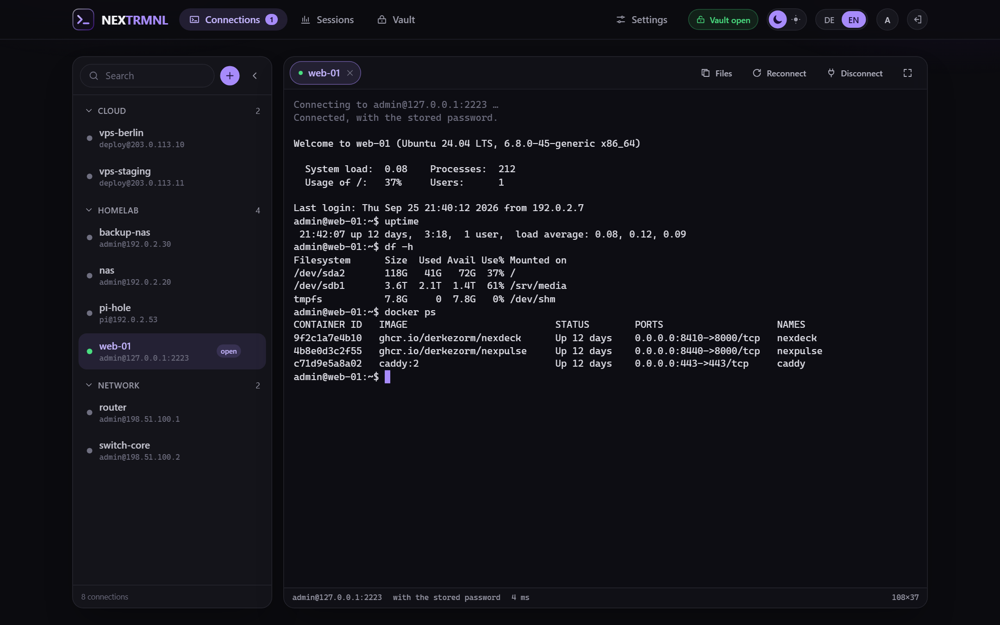
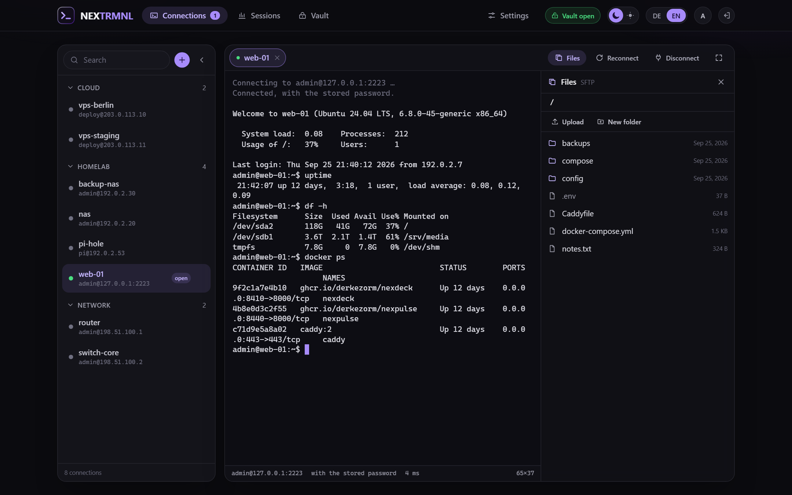
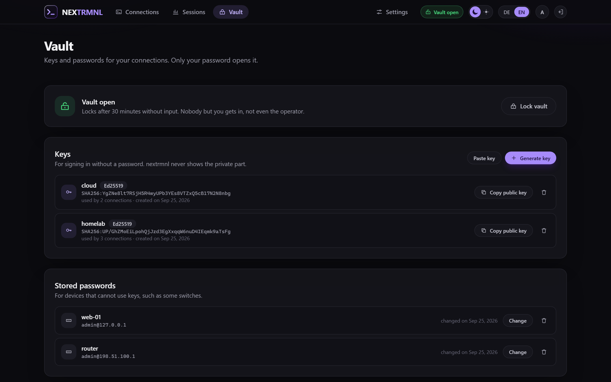

# nextrmnl

SSH and SFTP in the browser, self-hosted, for the machines in your own network. Accounts with a vault each,
host keys that are checked and remembered, and a terminal that copies and pastes the way PuTTY and Windows
Terminal do.

nextrmnl is part of the nex apps and looks like them.

## Screenshots



*The terminal, with the connection list pinned to the left. It floats above the terminal by default.*



*Files over SFTP next to the terminal: browse, upload, download, rename, delete.*



*The vault: keys and stored passwords, sealed with the account's password.*

## What it does

- **Terminal in the browser** (xterm.js) over a WebSocket to the nextrmnl server, which speaks SSH to your
  machines. Full-screen, tabs for open sessions, jump hosts, a command to run after sign-in, keepalives.
- **SFTP next to the terminal**: browse, upload with drag and drop, download, rename, delete, all through the
  same SSH connection.
- **Copy and paste like PuTTY**: selecting copies, Ctrl+Shift+C, Ctrl+Insert, Ctrl+C with a selection; paste with
  Ctrl+V, Ctrl+Shift+V, Shift+Insert or a right click. Several lines are shown before they run.
- **Accounts**: the first account is the operator, others come by invitation link or through OpenID Connect.
  Connections can be shared; sharing passes name, address and settings, never access.
- **Second factor**: a code from an authenticator app on top of the password (TOTP), with recovery codes for
  the day the phone is gone. The operator can require it for every password account; whoever locks themselves
  out gets it reset by the operator.
- **A vault per account** for private keys and stored passwords, encrypted with a key that only the account's
  password unwraps. Not the operator, not a backup, not a database dump can read it. Generate Ed25519 or RSA
  keys, or paste existing ones. Download the vault as an encrypted file and restore it, here or on another nextrmnl.
- **Host keys** are compared on every connection. Unknown hosts are shown with their fingerprint before you
  trust them; a changed key is refused until you say otherwise.
- **Allowed targets**: by default nextrmnl only connects into private networks (10/8, 172.16/12, 192.168/16,
  100.64/10 for VPNs, loopback, link-local). The operator can add networks and names, or open it up.
- **OpenID Connect**: any provider with discovery; for authentik there is a one-button setup that creates the
  provider, application, signing key and mappings with a one-time API token, or a blueprint file to do it
  without a token.
- **Backups**: consistent copies on a schedule and before every schema change, downloads as an AES encrypted
  ZIP that 7-Zip opens without nextrmnl, restore with a preview and a restart.
- **A log** with four levels (the deep ones switch themselves off), a request id in every line and in every
  error message, downloadable. Never with terminal content, keystrokes, passwords, keys or tokens.
- German and English; another language is one JSON file.

## Start

```yaml
services:
  nextrmnl:
    image: ghcr.io/derkezorm/nextrmnl:latest
    container_name: nextrmnl
    restart: unless-stopped
    ports:
      - "8460:8000"
    volumes:
      - ./data:/data
    environment:
      PUID: 1000
      PGID: 1000
      TZ: Europe/Berlin
```

```
docker compose up -d
```

Open `http://<your-host>:8460` and create the operator account. The password is at least 12 characters; it also
protects your vault.

**Put nextrmnl behind a reverse proxy with TLS** before you use it from anywhere but your own desk. It holds the
access to your machines. Pasting with a right click also needs HTTPS; the browser allows reading the clipboard
only on secure origins (Ctrl+V works regardless).

## Where things are stored

Everything lives in `/data`: the SQLite database `nextrmnl.db`, `secret.key`, `backups/`, `logs/`. Mount it
from a local disk, never from an SMB or NFS share.

`secret.key` protects the server-side secrets (the OIDC client secret). The vaults do not depend on it: they
open with the account's password only. Both go into the backup archive.

## Environment

| Variable | Default | Meaning |
|---|---|---|
| `NEXTRMNL_DATA_DIR` | `/data` | Data directory |
| `NEXTRMNL_SECRET_KEY` | created on first start | Protects the server-side secrets; when set, it wins over `secret.key` |
| `NEXTRMNL_PUBLIC_URL` | from the request | The address people use to reach nextrmnl; for invitation links and the OIDC redirect. The public address under Settings, Sign-in wins when set |
| `NEXTRMNL_LOG_LEVEL` | stored setting | `quiet`, `normal`, `detailed` or `trace`; overrides the setting, the emergency exit when the app does not start |
| `NEXTRMNL_TRUSTED_PROXIES` | none | Addresses or networks of reverse proxies whose `X-Forwarded-For` is believed, comma separated (`172.18.0.0/16, 10.0.0.5`). Without it every request counts as coming from its peer, so a proxy in front makes all its clients share one sign-in brake |
| `NEXTRMNL_SESSION_DAYS` | `14` | A browser session ends after this many days |
| `NEXTRMNL_API_DOCS` | `false` | Serves `/api/docs` and `/api/openapi.json`; off by default |
| `NEXTRMNL_COOKIE_SECURE` | `auto` | `on`, `off` or `auto` (from the request or `X-Forwarded-Proto`) |
| `NEXTRMNL_PORT` | `8000` | Port inside the container, for host networking |
| `PUID`, `PGID` | `1000` | Owner of the files in the data directory |

## Security in short

- Passwords are hashed with Argon2id. Ten failed sign-ins in a row lock the account for fifteen minutes.
- With a second factor, the password alone opens nothing: the vault key waits in memory for the code, at most
  five minutes and five tries. A code counts once; the seed is stored encrypted, recovery codes as hashes.
- The vault key is wrapped with Argon2id and AES-256-GCM; entries are AES-256-GCM. An open vault is its key in
  the server's memory, forgotten after 30 minutes without use (configurable) and on every restart.
- Every changing request needs the header `X-Requested-By: nextrmnl`; WebSockets must come from the same origin.
- Every password check while signed in (opening the vault, exporting it, changing the password, the second
  factor) counts like a sign-in: wrong answers lock the account. Terminals end with the sign-in they came with.
- A member of a shared connection signs in with their own user, key or password, and only their own start
  command runs in their shell; a stored password stays with the host, port and user it was given for.
- Responses carry a Content Security Policy, `X-Frame-Options: DENY` and friends.
- Host keys are verified before authentication; nothing is trusted automatically.
- The log never contains terminal content, keystrokes, passwords, passphrases, private keys or tokens, and a
  test scans the code for the obvious mistakes.

## Development

```
cd backend && python -m venv .venv && .venv/Scripts/pip install -r requirements-dev.txt
.venv/Scripts/uvicorn app.main:app --port 8460 --reload
cd frontend && npm ci && npm run dev
```

The frontend on port 5460 proxies `/api` to the backend. Tests: `pytest` in `backend`, `npx vitest run` in
`frontend`.

## License

AGPL-3.0.
